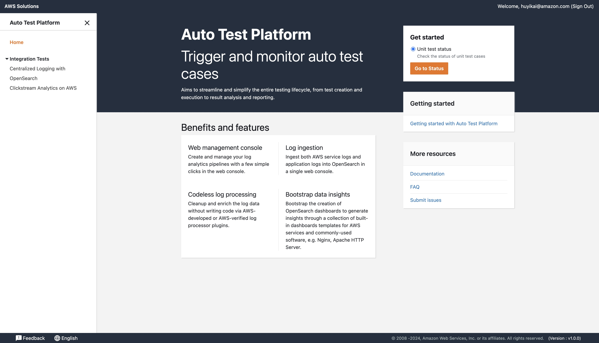
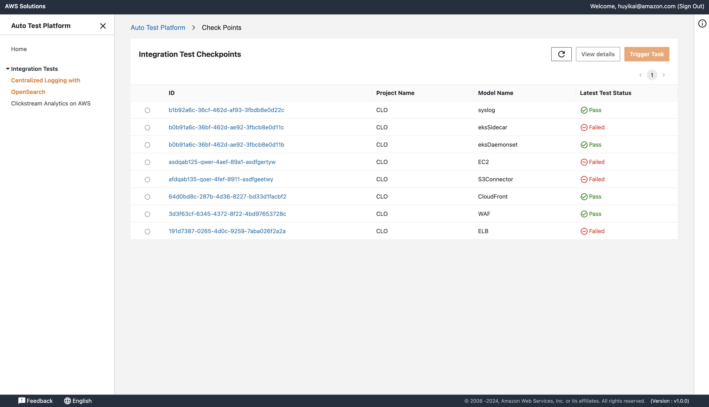
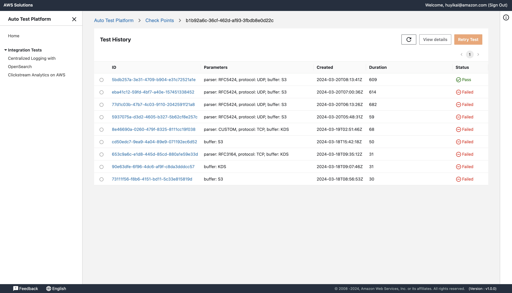
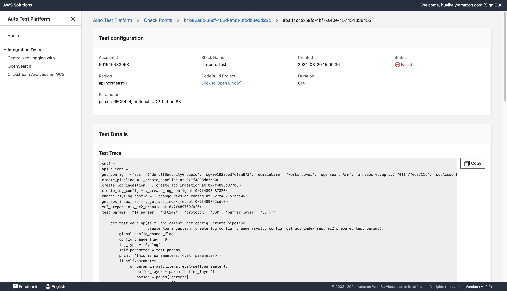
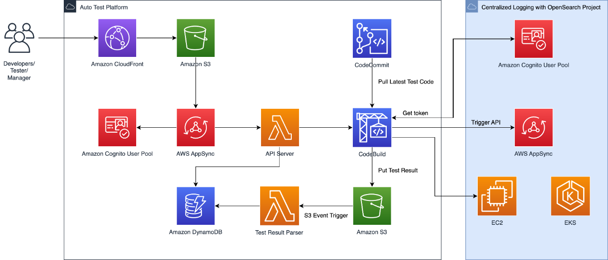

# Automated Testing Platform

This project utilizes the AWS Cloud Development Kit (CDK) to deploy an Automated Testing Platform, designed to streamline the execution of tests across various environments and frameworks. By leveraging cloud resources, the platform ensures scalability, reliability, and efficiency, making it easier for developers and QA engineers to integrate testing into their CI/CD pipelines.

## Features

- **Scalable Test Execution**: Dynamically scale testing resources based on demand.
- **Parallel Execution**: Run multiple tests in parallel to reduce overall testing time.
- **Comprehensive Reporting**: Generate detailed reports for test results analysis.
- **Notification System**: Get instant notifications on test outcomes through email or Slack.


## Setup

### Build the UI
```
cd source/portal
npm install --legacy-peer-deps
npm run build
```

### Deploy the CDK Stack
```
cd source/construct
npm install
npx cdk deploy AutoTestPlatform --parameters adminEmail=huyikai@amazon.com
```

## Usage

Home page


Checkpoints


Test history


Test detail


## Architecture

